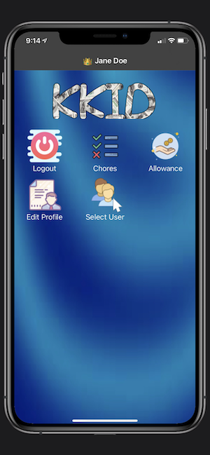
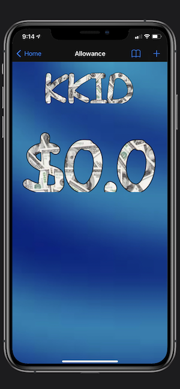
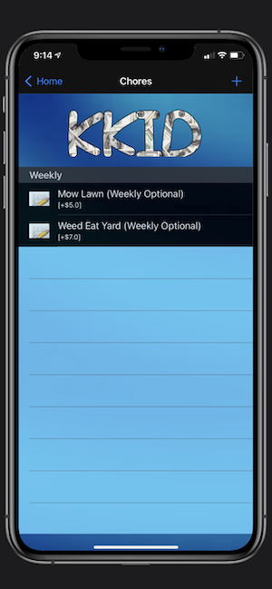

# KKid
KKid is an app for parents and their children to keep up with chores and allowance. With this app parents can create child accounts and add chores to their profile. Kids can then login and see their chores and mark them off each day. By turning on the allowance feature parents can add/subtract money from the kid's allowance account (this is a virtual "account" to show the kids how much allowance they have, no money is actually exchanged within the KKid app, think of it as a notebook) and the kids can view this when they login as well.

## Screenshots
| Home| Login | Allowance | Chores | Mark Chore |
| ----------------- |  ----------------- | ----------------- | ----------------- | ----------------- |
|  |   |   |   |   | 

## Frameworks Used
- Foundation
- UIKit
- CoreData
- CoreText

## Third Party Frameworks Used
- [Alamofire-SwiftyJSON](https://github.com/SwiftyJSON/Alamofire-SwiftyJSON)
- [Toast-Swift](https://github.com/scalessec/Toast-Swift)
- [SwiftyForm](https://github.com/neoneye/SwiftyFORM)
- [ReachabilitySwift](https://github.com/ashleymills/Reachability.swift)
- [SwiftMessages](https://github.com/SwiftKickMobile/SwiftMessages)
- [Sync](https://github.com/3lvis/Sync)

## Instructions

### Login Screen:
- On the login screen you can enter your username/email and password then click login to access the application.

- If you need to create a new Master Parent (household) account you may click on "New Parent Account"

- If you have forgotten your password you may enter your username in the username field and click "Forgot Password" and a reset link will be emailed to you.

- After login you will be taken to the "Home" Screen

#### NOTE: Child accounts and additional parent accounts for an existing household must be created after logging in as the master user or an admin user.

- DEMO Account
	- username: dev_kkid_master
	- password: LetmeN2it

### Home Screen (after login):
- On the home screen you will see a list of users under your master (household) account.

- If you are the master user (background on name will be purple) or an admin user (background on name will be gold/yellow) then you may add an additional user/kid/parent/admin by clicking the plus symbol in the upper right corner of the screen

- Clicking the back button in the upper left will sign you out of the application.

- Clicking on a user will take you to the "Select Module" screen for that user (NOTE: if you are not the master or an admin then you will only be able to select your own account from this list)

- If you are the master user or an admin user you can swipe left on a user to delete that user (NOTE: The master user can only be deleted once all other users have been deleted from the master account)

### Add User Screen:
- Enter the new user's username, email, password, first name, and last name. Then click submit
- NOTE: each user must have their own email address. We understand that some kids do not have their own email account. In this case you can use an email alias that is automatically build into all email accounts. To do this you just add + then the alias directly before the @ symbol of your email address. Example: if your email address is jane@doe.com and you need an email alias for jack then you can use jane+jack@doe.com. Any email sent to jane+jack@doe.com will be automatically forwarded to jane@doe.com.

### Select Module Screen:
- The "Select Module" Screen will be diffrent for each user. 
- You will always have Edit Profile which you can click on to edit that user's profile/permissions
- Below Edit Profile there will be options for each module that the selected user has access to
- Click on Edit Profile to edit the  user's profile or click on the module name to access that module for the user

### Edit Profile Module:
- To edit a the user's profile just change the information on the screen and click update in the upper right.
- If you are the master or an admin user then you will have switches for each module/permission. To turn on the permission for a user just change the switch to on. To remove a permission from the user then you turn the switch to off. Do not forget to click update in the upper right to update the users permissions as well.

### Chores Module:
- In this module you will see a table listing the selected user's chores for the week.
- To the left of the chore will be an icon indicating the status of that chore
- To mark off (change status of) a chore just select the chore and the "Mark Chore" screen will appear.
- If you are the master or an admin user then you may add a chore to the selected user by clicking the add button in the upper right corner of the screen to goto the "Add Chore" screen.
- If you are the master or an admin user then you may delete a chore by swiping the chore to the left

### Mark Chore Screen:
- On this screen you will see the options for marking the selected chore.
- Possible options on this screen are a green check (chore is completed), a blue dash (chore does not need to be completed), and a red x (chore was not done)
- Click on one of the markings (check,dash,x) to change the status of the chore.
- Note: some chores can be restricted by the parent to block the dash button which may cause this button to not be available. Also if a chore is marked as an X then the X is the only option available unless you are the master or admin user.

### Add Chore Screen:
- To add a chore to the selected user fill out the form and click submit in the upper right corner.
- If block dash is turned on then the user will not be able to mark this chore as a dash (chore does not need to be done today)
- If optional is turned on then this chore will be notated as optional on the chore list
- If Any Kid is turned on then this chore will show up on all users under your master/household account that have the chore module turned on
- Start Date is the date you wish this chore to start (Example: if today is Friday and you want to add a chore for next week then you may want to change the start date to next week)
- If One Time Chore is selected then this chore will be on this week's chore list only and will be deleted at the end of the week. By default chores are carried over to the following week.

#### NOTE: the weeks start on Sunday (Central Standard Time Zone)

### Allowance Module:
- This screen will display the user's current allowance balance
- Clicking the ledger icon (open book) in the upper right will launch the Ledger screen which will show all of the allowance transactions for this user
- Clicking the + icon in the upper right will launch the "Add Transaction" Screen

#### NOTE: The Allowance Module is for parents/kids to keep up with how much allowance they have so parents can give them a virtual allowance account instead of the kid keeping up with cash. The parent is the "Bank". No money is exchanged directly thru this app. It is only to keep track of how much allowance the parent "owes" the kid.

### Add Transaction Screen:
- On this screen you can add transactions (add/subtract) for the selected user's allowance. Just fill out the form and click submit
- Master and Admin users may add or subtract allowance
- Users that are not a master or admin may only subtract from their allowance account